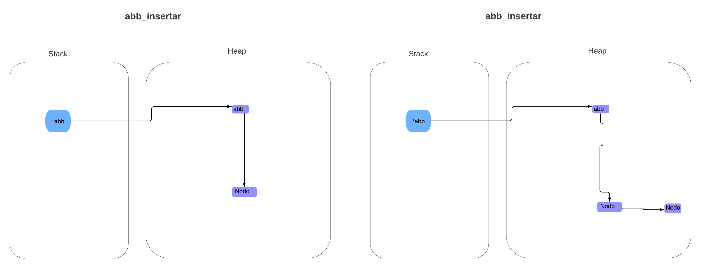
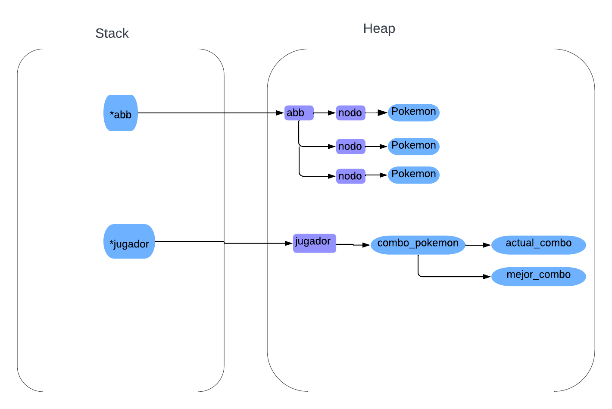

<div align="right">

</div>

# TP 2

## Repositorio de Tobias Portella - 112257 - tobias240405@gmail.com

- Para compilar:

```bash

gcc -Wall -Werror -O2 -g -c extra/engine.c -o engine.o
gcc -std=c99 -Wall -Wconversion -Wtype-limits -pedantic -Werror -O2 -g src/*.c tp2.c engine.o -o tp2
```

- Para ejecutar:

```bash
./tp2 datos/pokedex.csv
```

- Para ejecutar con valgrind:
```bash
valgrind --leak-check=full --track-origins=yes --show-reachable=yes --error-exitcode=2 --show-leak-kinds=all --trace-children=yes ./tp2 datos/pokedex.csv
```
---
## Funcionamiento

---El programa va a abrir un archivo CSV el cual va a contener los atributos de unos pokemones y lo va leer linea por linea usando la función leer_linea_csv, a esta función se le va a pasar el archivo, la cantidad de columnas que se desean leer, una función que recibe el string leído y un puntero al contexto, y por ultimo recibe también un puntero a un contexto. La función se va a ejecutar hasta que el archivo se quede sin lineas para leer, también se va a ejecutar la función abb_insertar() la cual va a agregar a los pokemones y los va a ordenar por su nombre.

<div align="center">

</div>

---El programa usa un TDA pokemon para crear los pokemones y almacenarlos en el abb, el programa llama a una función menu la cual desplegara las opciónes para elegir, que en este casi serian:

- P: Muestra el pokedex cargado. Se deben mostrar los pokemon por orden alfabético
  
- J: Jugar. Inicia el juego.
  
- S: Jugar con semilla. Inicia el juego pero pidiendo un número para utilizar como semilla.
  
- Q: Salir. Sale del juego.
  

---La primera opcion usara el iterador del abb para imprimir por pantalla todos los pokemones pasados.
la segunda opción iniciara el juego utilizando una semilla pseudo aleatoria relacionado con la hora, luego se iniciara el juego, el cual se correra en loop
hasta que se presione la letra 'q' o pasen 60 segundos, luego se crea otro abb donde usaremos pokemones aleatorios sacados de el anterior abb y estos seran los pokemones que tendremos en el tablero.

---En el juego al apretar los cursores se modificara la posición del jugador, y luego se verificara que el jugador este en la misma posición que un pokemon, si esto se cumple el pokemon sera cambiado por otro y posicionado nuevamente en el tablero pseudo aleatoriamente, también se almacenara el nombre del pokemon para un posible combo.

<div align="center">

</div>


---Luego se imprimira el tablero y todo lo necesario para el usuario, despues se repetira todo hasta que el usuario salga o se terminen los 60 segundos, por último se liberara toda la memoria y finalizara la ejecución.

---La tercera opcion hace lo mismo que la segunda solo que en vez de usar una semilla relacionada con la hora, le pide al usuario cual va a ser la semilla.

---La última opción simplemente termina la ejecución y libera la memoria 

## Respuestas a las preguntas teóricas
- Para el juego implemente un TDA jugador y un TDA pokemon, el TDA jugador me sirve principalmente para la ubicacion del jugador con las operaciones jugador_insertar_posicion_x, jugador_insertar_posicion_y, jugador_aumentar_en_1__posicion_x y jugador_aumentar_en_1__posicion_y ,también me sirve para almacenar la información del juego como por ejemplo el multiplicador que tiene el jugador con jugador, o el combo del jugador con jugador_insertar_pokemon_combo.

- El TDA pokemon lo use para almacenar los datos necesarios para el juego,su operación mas importante es pokemon_insertar_atributos y también considero que de sus operaciones mas importantes estan pokemon_insertar_posicion, pokemon_aumentar_en_1_posicion_x y pokemon_aumentar_en_1_posicion_y

- Estos TDA tienen la responsabilidad de ser con los que se interactua en el juego, tanto en su movimientos, sus atributos, la información que poseen que sera la mostrada en pantalla, es importante que estos TDA funcionen correctamente y su información almacenada sea la adecuada, porque son los elementos pprincipales del juego.

- En el juego utilice un Arbol Binario de Busqueda el cual es un árbol que la raíz tiene solo un hijo izquierdo y un hijo derecho, y cada uno de esos hijos puede ser la raíz de su propio subarbol, una forma de usar esta estructura de datos es asignándole un valor a cada nodo y todo valor menor al de ese nodo se va a posicionar a su lado izquierdo y todo valor mayor se va a colocar al lado derecho. Este lo use para almacenar los pokemones, use 2 ABB, uno para todos los pokemones posibles a utilizar y otro que son los pokemones que van a aparecer en el tablero